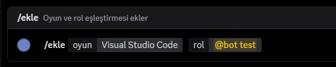
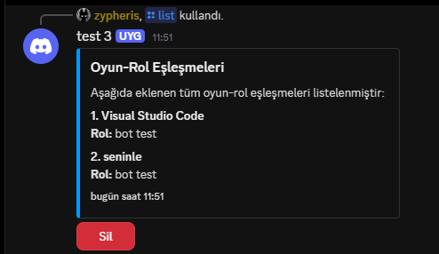
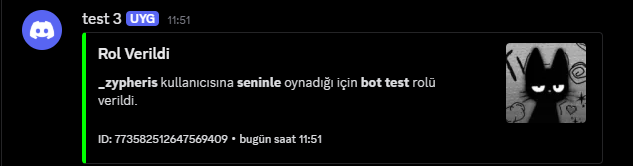

# 🎮 Oyun-Rol Botu  

Oyun tutkunları için tasarlanmış, Discord sunucularınıza eğlence ve düzen katan **Oyun-Rol Botu**! Belirttiğiniz oyunları oynayan üyelerinize otomatik olarak roller atar ve oyunu oynamayı bıraktıklarında rollerini geri alır. 🌟  

---

## 🚀 Özellikler  

### 🎲 **Oyun Ekleme**  
- **Komut**: `/ekle [oyun adı] @rol`  
  - Belirttiğiniz oyun adını ve rolü ekler. Bu oyunu oynayan kullanıcılara otomatik olarak rol atanır.  

  

---

### 📜 **Listeleme ve Yönetim**  
- **Komut**: `/list`  
  - Eklenen tüm oyun adlarını ve rollerini gösterir.  
  - **Butonlu Silme**: Oyun-rol eşleştirmelerini kolayca silebilirsiniz.  
  - **Select Menüsü**: Listeyi daha kolay yönetmek için seçilebilir menü desteği.  

  

---

### 🖊️ **Loglama**  
- **Komut**: `/log [#kanal]`  
  - Bir oyuncuya rol atandığında veya alındığında belirttiğiniz kanala bildirim gönderir.  
    - "🎉 **Rol verdim**: [oyuncu] → [rol]"  
    - "💔 **Rol aldım**: [oyuncu] → [rol]"  

  

---

## 🛠️ Kurulum  

### 🧾 **Gereksinimler**  
- [Node.js](https://nodejs.org) (v16 ve üzeri)  
- [Discord.js](https://discord.js.org) (v14)  

---

## 📞 İletişim

[](https://discord.gg/sxWz2fayFa)
---

### 🚀 **Botun Çalıştırılması**  
1. **Depoyu klonlayın**:  
   ```bash
   git clone https://github.com/Zypheris/oyun-rol.git
   cd oyun-rol
